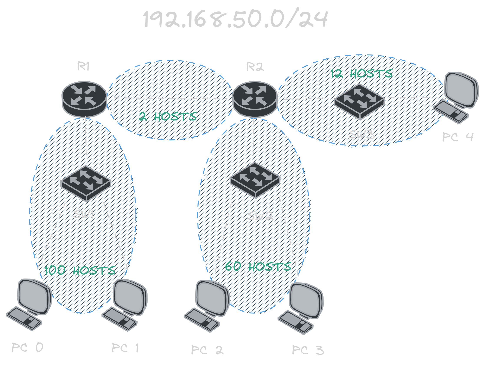
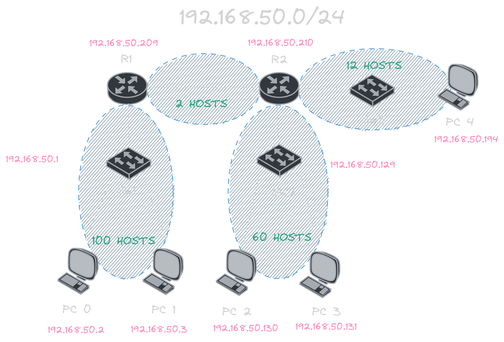

En esta entrada, exploraremos un método eficiente para implementar VLSM (Variable Length Subnet Mask), permitiéndonos crear subredes con tamaños diversos sin redundancias.

## ¿Qué es VLSM?

VLSM (Máscara de Subred de Longitud Variable, por sus siglas en inglés) es una técnica que posibilita la creación de subredes con diferentes tamaños, evitando la uniformidad en la cantidad de hosts por subred. Esto optimiza la asignación de direcciones IP y permite una mayor eficiencia en el uso del espacio de direcciones IPv4 disponible.

## ¿Cómo funciona?

Para comprender VLSM, es fundamental tener claridad sobre el direccionamiento IP en IPv4. Una dirección IP consta de 32 bits divididos en 4 octetos de 8 bits cada uno. Estos octetos se expresan en notación decimal separada por puntos. Por ejemplo:

`192.168.50.0/24`

Supongamos que nos piden crear sub-redes con diferentes tamaños con los Hosts que se muestran a continuación:

Como podemos observar en la imagen tenemos la dirección: `192.168.50.0/24` a la cual nos solicitan crear sub-redes con diferentes tamaños los cuales son:

- `R1` -> `R2`: 2 Hosts
- `R1` -> `SW1`: 100 Hosts
- `R2` -> `SW2`: 60 Hosts
- `R2` -> `SW3`: 12 Hosts

Para poder crear estas sub-redes debemos tener en cuenta que la dirección `0` tiene una máscara de red `/24` lo que significa que los primeros 24 bits de la dirección son la red y los últimos 8 bits son los hosts.

Para este ejemplo vamos a utilizar el siguiente método:

### Tabla de valores

La tabla de valores es una tabla que nos permite saber cual es el la cantidad hosts, la mascara mascara, prefijo y la cantidad de bits que se necesitan para crear una sub-red con la cantidad de hosts que necesitamos. Desconozco si este método tiene un nombre especifico o si alguien mas lo ha creado, pero yo lo he llamado "Tabla de valores" y funciona de la siguiente manera:

La tabla se compone de 9 columnas:

| Clave             |     |     |     |     |     |     |     |     |     |
| :---------------- | :-: | :-: | :-: | :-: | :-: | :-: | :-: | :-: | :-: |
| Hosts disponibles |     | 126 | 62  | 30  | 14  |  6  |  2  |     |     |
| Hosts totales     |     | 128 | 64  | 32  | 16  |  8  |  4  |  2  |  1  |
| Prefijo           | /24 | /25 | /26 | /27 | /28 | /29 | /30 | /31 | /32 |
| Mascara           |  0  | 128 | 192 | 224 | 240 | 248 | 252 | 254 | 255 |

Esta tabla nos permite identificar casi instantáneamente los valores que necesitamos para crear una sub-red con la cantidad de hosts que necesitamos. Por ejemplo, si necesitamos crear una sub-red con 60 hosts, podemos ver que la columna de "Hosts disponibles" tiene el valor 62, lo que significa que necesitamos una mascara de red `/26` y que nos sobran 2 hosts.

El método nos permite crear una tabla donde rápidamente podremos sacar sub-redes con diferentes tamaños, para crear la tabla debemos seguir los siguientes pasos:

1. Crear una tabla ordenando de mayor a menor la cantidad de hosts que nos solicitan.
2. En la primera columna colocar la cantidad de hosts que nos solicitan.
3. En la segunda columna colocar la cantidad de **hosts disponibles** que tiene que ser mayor a la cantidad de hosts que nos solicitan.
4. En la tercera columna se colocara la dirección de red, que en este caso es `0` al ser la primera dirección disponible.
5. En la cuarta columna se colocara el rango disponible de redes entre la dirección de red y la dirección de broadcast.
   > Por ejemplo: en este caso la dirección de red es `...0` y la de broadcast es la dirección de red mas el salto de red menos 1, es decir, `...127`, asi que el rango disponible es `...1 - ...126` ya que la dirección de red y la de broadcast no se pueden utilizar.
6. En la quinta columna se colocara la dirección de broadcast, que en este caso es `...127`.

7. La sexta y séptima columna se obtiene de la segunda columna, es decir, la cantidad de hosts disponibles, usando la tabla de valores podemos ver que para 128 hosts totales nuestra mascara es `128` y nuestro prefijo es `/25`.

8. Para la siguiente fila simplemente se repite el proceso, pero se iniciara con la dirección de broadcast de la fila anterior mas 1, en este caso `...128`.

| Hosts | Salto | Red |   Hosts   | Broadcast | Mascara | Prefijo |
| :---: | :---: | :-: | :-------: | :-------: | :-----: | :-----: |
|  100  |  128  |  0  |  1 - 126  |    127    |   128   |   /25   |
|  60   |  64   | 128 | 129 - 190 |    191    |   192   |   /26   |
|  12   |  16   | 192 | 193 - 206 |    207    |   240   |   /28   |
|   2   |   4   | 208 | 209 - 210 |    211    |   252   |   /30   |

Como pudimos observar con unos simples pasos pudimos obtener las sub-redes que necesitábamos, pero aun no hemos terminado, ya que debemos asignar las sub-redes a los dispositivos que nos solicitan.

## Asignación de sub-redes

Para asignar las sub-redes a los dispositivos debemos tener en cuenta que la dirección de red y la dirección de broadcast no se pueden utilizar, por lo que debemos asignar la primera dirección de nuestro rango usable a la interfaz del dispositivo y la dirección de broadcast a la ultima dirección usable.

| Dispositivo | Interfaz | IP  | Gateway | Mascara |
| :---------: | :------: | :-: | :-----: | :-----: |
|     R1      |   G0/0   | 209 |         |   252   |
|     R2      |   G0/1   | 210 |         |   252   |
|     SW1     |  VLAN 1  |  1  |   209   |   128   |
|     SW2     |  VLAN 1  | 129 |   209   |   192   |
|     SW3     |  VLAN 1  | 193 |   210   |   240   |
|     PC0     |   NIC    |  2  |   209   |   128   |
|     PC1     |   NIC    |  3  |   209   |   128   |
|     PC2     |   NIC    | 130 |   209   |   192   |
|     PC3     |   NIC    | 131 |   209   |   192   |
|     PC4     |   NIC    | 194 |   210   |   240   |

Se preguntaran, de donde salieron esas direcciones IP, bueno, es muy sencillo, pero expliquemos paso a paso:

### R1 y R2

En la tabla donde hicimos VLSM pudimos ver que en nuestro rango usable de direcciones solo teníamos 2 redes disponibles, por lo que por lógica se puede inferir que era una dirección para cada router.

### SW1, SW2 y SW3

Para estos dispositivos simplemente se asigno la primera dirección del rango usable a la interfaz de cada sub-red que se creo, en este caso las direcciones son: `...1`, `...129` y `...193`.

### PC0, PC1, PC2, PC3 y PC4

Para estos dispositivos simplemente se asignaron las direcciones siguientes a la dirección que se le asigno a su respectivo switch, por ejemplo:

- El SW1 tiene la dirección `...1` por lo que la PC0 y PC1 tienen las direcciones `...2` y `...3` respectivamente.

- El SW2 tiene la dirección `...129` por lo que la PC2 y PC3 tienen las direcciones `...130` y `...131` respectivamente.

- El SW3 tiene la dirección `...193` por lo que la PC4 tiene la dirección `...194`.

### Gateway predeterminado

El gateway predeterminado es la dirección IP de la interfaz del router que esta conectada a la sub-red, por ejemplo:

- El SW1 y SW2 tienen como gateway predeterminado la dirección `...209` ya que es la dirección de la interfaz del R1 que esta conectada a la sub-red, de igual forma los dispositivos conectados a estos switches tienen como gateway predeterminado la dirección `...209`.

- El SW3 tiene como gateway predeterminado la dirección `...210` ya que es la dirección de la interfaz del R2 que esta conectada a la sub-red, de igual forma el único dispositivo conectado a este switch tiene como gateway predeterminado la dirección `...210`.

## Ejemplo terminado

## Conclusión

Mi objetivo con esta publicación es poder ayudar a las personas que están aprendiendo VLSM y que no entienden como funciona, ya sea por que el método que estén utilizando es muy confuso o muy largo, ya que yo también tuve ese problema, por lo que me puse a estudiar y desarrolle este método que me ha ayudado mucho a la hora de hacer VLSM a la hora de hacer mis practicas.
